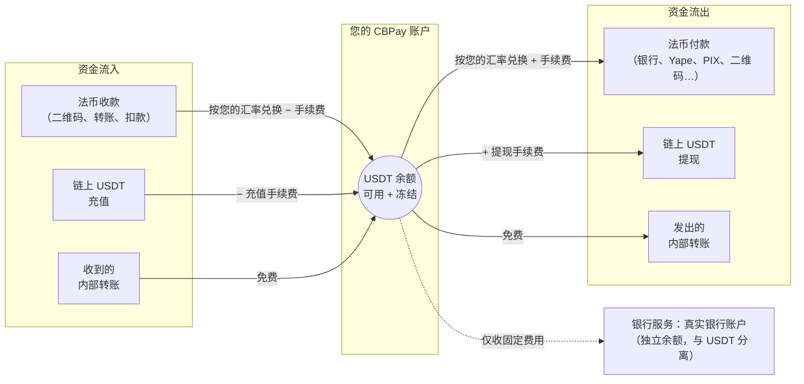

CBPay 是一个面向拉丁美洲的多币种支付平台。每个账户持有
**四个相互独立的虚拟余额** —— `USDT`（运营币种）、`USDC`、`BTC` 和
`GOLD`（黄金克数）—— 并基于它们进行操作：

<CardGroup cols={2}>
  <Card title="法币付款（Payouts）" icon="money-bill-transfer" href="/zh/guides/payouts">
    向智利、秘鲁、墨西哥、委内瑞拉、玻利维亚、巴西、巴拉圭、厄瓜多尔和
    阿根廷的本地银行账户付款——包括支付扫描到的 PIX 二维码。
  </Card>
  <Card title="法币收款（Payins）" icon="qrcode" href="/zh/guides/payins">
    以本地货币收款（二维码、转账、专属账户、主动扣款），并自动入账。
  </Card>
  <Card title="Checkout 收款链接" icon="cart-shopping" href="/zh/guides/checkout">
    一个通用支付链接：付款人在托管页面选择国家、支付方式或加密货币，
    您以自己选择的资产结算。
  </Card>
  <Card title="卡片与订阅" icon="credit-card" href="/zh/guides/cards">
    发行可实时消费任一余额的卡片，受理卡支付，[保存卡片并安排周期性
    扣款](/zh/guides/stored-cards-subscriptions)。
  </Card>
  <Card title="QR POS" icon="store" href="/zh/guides/qr-pos">
    注册已验证的商户，为线下销售点生成带金额的加密货币收款二维码。
  </Card>
  <Card title="链上加密资产" icon="link" href="/zh/guides/crypto">
    通过 TRON 和 Ethereum 充值与提现 USDT/USDC，通过 Bitcoin 网络
    收发原生 BTC——每个账户出生即带充值钱包。
  </Card>
  <Card title="兑换（Swaps）" icon="arrows-rotate" href="/zh/guides/swaps">
    按账户报价即时兑换 USDT、USDC、BTC 与 GOLD 余额。
  </Card>
  <Card title="内部转账" icon="arrows-left-right" href="/zh/guides/transfers">
    将余额转给任何其他 CBPay 账户——按 ID、别名、二维码或已验证的
    手机号——即时到账且完全免费。
  </Card>
  <Card title="银行服务（Banking）" icon="building-columns" href="/zh/guides/banking">
    以您名义开立的真实银行账户：通过国际清算网络（SEPA、SWIFT、
    ACH）收款、持有和付款，含第三方账户。
  </Card>
  <Card title="隔离钱包" icon="wallet" href="/zh/guides/segregated-wallets">
    拥有独立余额、与账本隔离的专属链上钱包——支持创建、导入与导出。
  </Card>
  <Card title="KYC/KYB 与合规" icon="user-check" href="/zh/guides/kyc">
    个人与企业身份验证，外加独立的 [AML 筛查](/zh/guides/aml)与
    [加密货币地址筛查](/zh/guides/screenings)。
  </Card>
  <Card title="对账单与分析" icon="file-invoice" href="/zh/guides/statement">
    按期间生成完整对账单（JSON、PDF、Excel）并保证会计平衡，每笔操作
    有[凭证](/zh/guides/receipts)，还有可直接绘图的
    [分析摘要](/zh/guides/analytics)。
  </Card>
</CardGroup>

每个事件都会送达您的**签名 webhook**（[指南](/zh/webhooks)）。

## 工作原理

法币操作围绕 USDT 余额进行 —— 资金从一端进入，完成兑换后从另一端
流出。USDC、BTC 和 GOLD 余额通过[兑换](/zh/guides/swaps)、链上充值与
提现、内部转账、payout 结算（`settlement_asset`）以及 payin 自动兑换
（`default_payin_asset`）变动：

1. CBPay 为您开通访问权限：邮箱/密码注册，或直接使用 API 密钥。
2. 您为账户注资：通过法币收款或链上 USDT 充值。
3. 您开始操作：付款、转账、提现 —— 所有操作都在执行时按汇率兑换，
   并对您的 USDT 余额进行借记和贷记。
4. 您随时掌握动态：每笔变动都记录在不可篡改的历史中
   （`GET /v1/movements`），事件会推送到您的 webhook。

## 基础 URL 与环境

CBPay 运行两个完全隔离、API 完全一致的环境：

| 环境 | 基础 URL | API 密钥 | 资金 |
|---|---|---|---|
| **Test** | `https://cryptobank.qbank.cl/platform` | `pk_test_...` | 模拟资金——每条清算通道由确定性模拟器提供 |
| **Live** | `https://api.qbank.cl/platform` | `pk_...` | 真实且不可逆 |

本文档中的所有路径均相对于这些基础 URL。请先在 **test** 环境构建，
再通过切换 URL 和密钥上线——详情、魔法值与上线检查清单见
[环境与测试](/zh/environment-testing)。

<Note>
金额始终为**十进制字符串**（例如 `"10.500000"`），绝不使用浮点数。
每种货币使用各自的精度：`USDT`/`USDC`/`GOLD` 为 6 位小数，`BTC` 为
8 位小数。
</Note>

## 后续步骤

<Steps>
  <Step title="创建账户和令牌">
    按照[快速开始](/zh/quickstart)完成注册并发起第一次调用。
  </Step>
  <Step title="理解资金模型">
    阅读[资金模型](/zh/concepts/money-model)和
    [手续费](/zh/concepts/fees)。
  </Step>
  <Step title="集成您的第一个产品">
    从[付款](/zh/guides/payouts)或[收款](/zh/guides/payins)开始。
  </Step>
</Steps>
