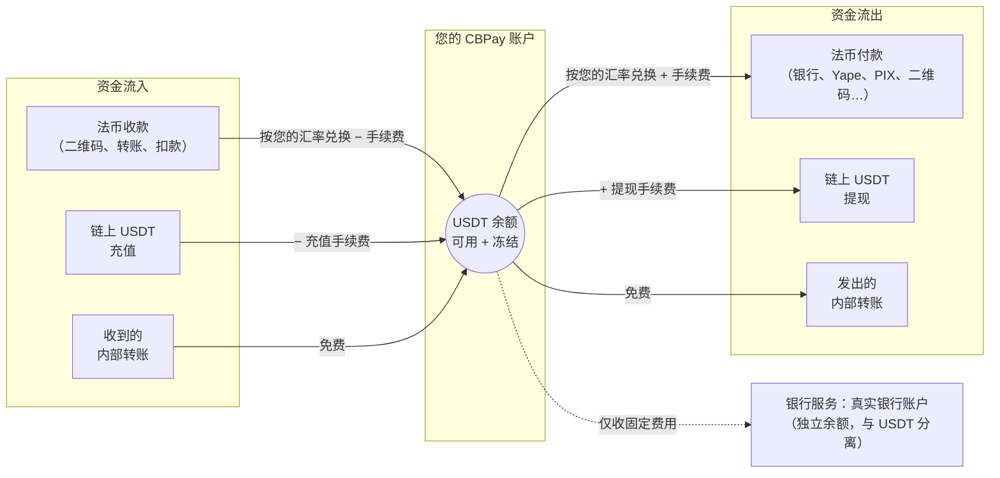

CBPay 是一个面向拉丁美洲的多币种支付平台。每个账户持有
**四个相互独立的虚拟余额** —— `USDT`（运营币种）、`USDC`、`BTC` 和
`GOLD`（黄金克数）—— 并基于它们进行操作：

<CardGroup cols={2}>
  <Card title="法币付款（Payouts）" icon="money-bill-transfer" href="/zh/guides/payouts">
    向智利、秘鲁、墨西哥、委内瑞拉、玻利维亚、巴西、巴拉圭、厄瓜多尔和阿根廷
    的本地银行账户付款，从您的 USDT 余额中扣款。
  </Card>
  <Card title="法币收款（Payins）" icon="qrcode" href="/zh/guides/payins">
    以本地货币收款（二维码、转账、托管支付页面和主动扣款），并自动
    以 USDT 入账。
  </Card>
  <Card title="内部转账" icon="arrows-left-right" href="/zh/guides/transfers">
    将余额转给任何其他 CBPay 账户，即时到账且完全免费。
  </Card>
  <Card title="链上加密资产" icon="link" href="/zh/guides/crypto">
    通过 TRON 或 Ethereum 以 USDT 充值，并可链上提现到任意地址。
  </Card>
  <Card title="卡片" icon="credit-card" href="/zh/guides/cards">
    发行虚拟卡和实体卡，直接实时消费账户的任一余额（USDT、USDC、
    BTC 或 GOLD）。
  </Card>
  <Card title="银行服务（Banking）" icon="building-columns" href="/zh/guides/banking">
    以您名义开立的真实银行账户：通过国际清算网络（SEPA、SWIFT、
    ACH）收款、持有和付款。
  </Card>
  <Card title="KYC/KYB" icon="user-check" href="/zh/guides/kyc">
    个人与企业身份验证，含 AML 筛查、重新筛查和持续监控。
  </Card>
  <Card title="对账单" icon="file-invoice" href="/zh/guides/statement">
    按期间生成完整账户对账单（JSON、PDF 或 Excel），并保证会计
    平衡。
  </Card>
</CardGroup>

每个事件都会送达您的**签名 webhook**（[指南](/zh/webhooks)）。

## 工作原理

法币操作围绕 USDT 余额进行（USDC、BTC 和 GOLD 余额通过内部转账、
链上充值和运营方入账变动）—— 资金从一端进入，完成兑换后从另一端
流出：



1. CBPay 为您开通访问权限：邮箱/密码注册，或直接使用 API 密钥。
2. 您为账户注资：通过法币收款或链上 USDT 充值。
3. 您开始操作：付款、转账、提现 —— 所有操作都在执行时按汇率兑换，
   并对您的 USDT 余额进行借记和贷记。
4. 您随时掌握动态：每笔变动都记录在不可篡改的历史中
   （`GET /v1/movements`），事件会推送到您的 webhook。

## 基础 URL

```
https://api.qbank.cl/platform
```

本文档中的所有路径均相对于该基础 URL。

<Note>
金额始终为**十进制字符串**（例如 `"10.500000"`），绝不使用浮点数。
每种货币使用各自的精度：`USDT`/`USDC`/`GOLD` 为 6 位小数，`BTC` 为
8 位小数。
</Note>

## 后续步骤

<Steps>
  <Step title="创建账户和令牌">
    按照[快速开始](/zh/quickstart)完成注册并发起第一次调用。
  </Step>
  <Step title="理解资金模型">
    阅读[资金模型](/zh/concepts/money-model)和
    [手续费](/zh/concepts/fees)。
  </Step>
  <Step title="集成您的第一个产品">
    从[付款](/zh/guides/payouts)或[收款](/zh/guides/payins)开始。
  </Step>
</Steps>
