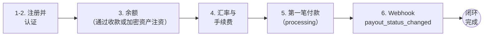

这是首次集成的完整路径：注册 → 余额 → 汇率 → 付款 → webhook。
完成后，您将走完整个闭环：



开始之前，这些是您在各处都会用到的信息：

| 项目 | 值 |
|---|---|
| **基础 URL（live）** | `https://api.qbank.cl/platform` |
| **基础 URL（test）** | `https://cryptobank.qbank.cl/platform` —— 模拟资金，`pk_test_` 密钥 |
| **认证方式** | `Authorization: Bearer <token>` 请求头（或 `X-API-Key`） |
| **组织 slug** | `cbpay`（用于注册和登录） |
| **余额币种** | 4 个独立余额：USDT（运营币种）、USDC、BTC 和 GOLD —— 金额始终为字符串（`"52.618258"`） |
| **环境** | 两个相互隔离的环境，同一套 API：先在 **test** 集成，再更换 URL + 密钥上线 —— [指南](/zh/environment-testing) |

<Tip>
请先在**测试环境**（`https://cryptobank.qbank.cl/platform`）运行本快速开始：账户天生已通过验证并带有演示历史数据，每笔付款几秒内即可完成，且不会有任何真实资金流动。下方步骤展示的是
live URL —— 在 test 环境同样适用。
</Tip>

<Info>
如果 CBPay 已为您创建账户并提供了 `pk_...` API 密钥，可直接跳到
第 3 步。常见问题已提前汇总在 [FAQ](/zh/faq) 中。
</Info>

<Steps>

<Step title="注册">

创建您的账户（个人或企业 —— 同一端点，仅 `type` 不同）：

<CodeGroup>

```bash Person
curl -X POST https://api.qbank.cl/platform/v1/auth/register \
  -H "Content-Type: application/json" \
  -d '{
    "org": "cbpay",
    "type": "person",
    "email": "ana@example.com",
    "password": "a-secure-password",
    "display_name": "Ana Perez",
    "country": "CL"
  }'
```

```bash Company
curl -X POST https://api.qbank.cl/platform/v1/auth/register \
  -H "Content-Type: application/json" \
  -d '{
    "org": "cbpay",
    "type": "company",
    "email": "legal@andina.cl",
    "password": "a-secure-password",
    "display_name": "Comercial Andina SpA",
    "tax_id": "76.543.210-8",
    "country": "CL"
  }'
```

</CodeGroup>

响应中包含您的 `access_token`（24 小时会话）：

```json
{
  "account": { "id": "…", "type": "person", "kyc_status": "none", "…": "…" },
  "access_token": "eyJhbGciOiJIUzI1NiIs…",
  "expires_at": "2026-07-08T00:00:00Z"
}
```

</Step>

<Step title="为每次调用附加认证">

在 `Authorization` 请求头中发送令牌：

```bash
curl https://api.qbank.cl/platform/v1/me \
  -H "Authorization: Bearer <access_token>"
```

对于服务器到服务器的集成，请通过 `POST /v1/api-keys` 签发一个
**永久 API 密钥** —— 仅显示一次。详见[认证](/zh/authentication)。

</Step>

<Step title="查询余额">

```bash
curl https://api.qbank.cl/platform/v1/balances \
  -H "Authorization: Bearer <token>"
```

```json
{
  "account_id": "…",
  "balances": [
    { "asset": "USDT", "available": "0.000000", "held": "0.000000" },
    { "asset": "USDC", "available": "0.000000", "held": "0.000000" },
    { "asset": "BTC", "available": "0.00000000", "held": "0.00000000" },
    { "asset": "GOLD", "available": "0.000000", "held": "0.000000" }
  ]
}
```

要进行操作，您需要先有资金：创建一笔[收款](/zh/guides/payins)，
或通过[加密资产注资](/zh/guides/crypto)在链上充值 USDT。

</Step>

<Step title="查询汇率与手续费">

发起付款之前，先查询当前汇率和您的实际手续费：

```bash
curl https://api.qbank.cl/platform/v1/rates \
  -H "Authorization: Bearer <token>"
```

```json
{
  "base": "USD",
  "rates": {
    "chile": { "currency": "CLP", "rate": "950.25" },
    "mexico": { "currency": "MXN", "rate": "17.50" },
    "bolivia": { "currency": "BOB", "rate": "6.91" }
  },
  "fees": [
    { "service": "payout", "country": "CL", "percent": "0", "fixed": "0.50" }
  ],
  "updated_at": "2026-07-07T12:00:00Z"
}
```

返回的汇率已包含您的外汇加成，因此可以在创建前估算成本：
`usdt_amount ≈ local_amount / rate`（向上取整），且
`total_debit = usdt_amount + fixed`。

</Step>

<Step title="创建您的第一笔付款">

```bash
curl -X POST https://api.qbank.cl/platform/v1/payouts \
  -H "Authorization: Bearer <token>" \
  -H "Content-Type: application/json" \
  -d '{
    "country": "CL",
    "currency": "CLP",
    "method": "bank_transfer",
    "amount": "50000",
    "beneficiary": {
      "name": "Juan Soto",
      "rut": "12345678-9",
      "bank_code": "012",
      "account_type": "checking",
      "account_number": "001122334455"
    },
    "description": "Supplier payment",
    "idempotency_key": "my-payment-0001"
  }'
```

响应 `202 Accepted` —— 付款处于 `processing` 状态，最终状态将通过
[webhook](/zh/webhooks) 送达（`payout_status_changed`）：

```json
{
  "payout_id": "…",
  "status": "processing",
  "local_amount": "50000",
  "fx_rate": "950.25",
  "usdt_amount": "52.618258",
  "fee": "0.500000",
  "total_debit": "53.118258"
}
```

<Warning>
`beneficiary` 字段随国家和方式而异。请通过
`GET /v1/payouts/methods` 和 `GET /v1/payouts/banks?country=CL` 查询
各通道的要求 —— 完整参考见
[付款指南中的各国示例](/zh/guides/payouts#examples-by-country)。
</Warning>

</Step>

<Step title="闭环：订阅 webhook">

付款的最终状态通过推送送达。请订阅您的 HTTPS 端点
（开发阶段可使用
[隧道](/zh/environment-testing#testing-webhooks-in-local-development)）：

```bash
curl -X POST https://api.qbank.cl/platform/v1/webhooks/subscriptions \
  -H "Authorization: Bearer <token>" \
  -H "Content-Type: application/json" \
  -d '{
    "event_type": "payout_status_changed",
    "callback_url": "https://yourapp.com/webhooks/cbpay",
    "secret": "a-long-random-secret"
  }'
```

几分钟后，您将收到第 5 步那笔付款的闭环通知：

```json
{
  "payout_id": "…",
  "status": "completed",
  "local_amount": "50000",
  "usdt_amount": "52.618258",
  "total_debit": "53.118258",
  "status_code": ""
}
```

**务必**验证每次投递的 HMAC 签名（`X-Webhook-Signature`）——
含代码的完整做法见 [webhooks](/zh/webhooks)。如果付款失败，将收到
`status: failed`，且全额退款已自动完成。

</Step>

</Steps>

## 接下来做什么？

<CardGroup cols={2}>
  <Card title="集成流程" icon="route" href="/zh/flows">
    注资、付款、收款、对账和银行服务 —— 五个端到端流程，附流程图。
  </Card>
  <Card title="资金模型" icon="coins" href="/zh/concepts/money-model">
    借记、冻结、退款和不可篡改的账本。
  </Card>
  <Card title="环境与测试" icon="flask" href="/zh/environment-testing">
    如何安全地测试，以及上线前检查清单。
  </Card>
  <Card title="常见问题" icon="circle-question" href="/zh/faq">
    来自真实集成者的问题及解答 —— 完整的 API 参考在独立的标签页中，
    并提供交互式演练场。
  </Card>
</CardGroup>
