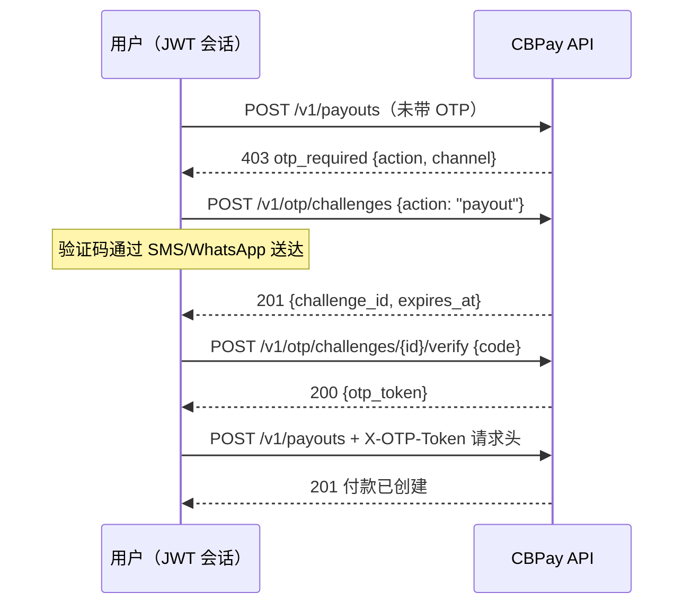

CBPay 可以在敏感操作之前要求提供**一次性验证码（OTP）**：登录、创建付款（payout）、提取加密资产、查看卡片信息、签发 API 密钥……验证码通过 **SMS 或 WhatsApp** 发送到账户绑定的手机号，由您的运营方决定**哪些操作需要验证码以及通过哪个渠道发送**——可按账户或整个组织配置。

<Note>
OTP **仅适用于用户会话**（JWT 登录）。**`pk_` API 密钥豁免**：它们是服务器到服务器的集成，另一端没有持有手机的真人。如果您的整个业务都通过 API 密钥运行，本页内容不会对您的集成产生任何影响。
</Note>

## 工作原理



`otp_token` 为**一次性使用**，绑定到您的用户及其签发时对应的操作，并随质询（challenge）一同过期（验证码发送后 10 分钟）。

## 1. 查询您的策略

`GET /v1/otp/settings` 会告诉您 OTP 是否已启用，以及哪些操作需要验证码：

```bash
curl https://api.qbank.cl/platform/v1/otp/settings \
  -H "Authorization: Bearer <token>"
```

```json
{
  "enabled": true,
  "phone": "********5678",
  "phone_verified": true,
  "actions": [
    { "action": "login", "required": true, "channel": "sms" },
    { "action": "payout", "required": true, "channel": "whatsapp" },
    { "action": "crypto_withdrawal", "required": true, "channel": "sms" },
    { "action": "transfer", "required": false, "channel": "sms" },
    { "action": "banking_operation", "required": false, "channel": "sms" },
    { "action": "card_reveal", "required": true, "channel": "sms" },
    { "action": "api_key_create", "required": true, "channel": "sms" },
    { "action": "member_add", "required": false, "channel": "sms" },
    { "action": "phone_change", "required": true, "channel": "sms" }
  ]
}
```

## 2. 请求验证码

```bash
curl -X POST https://api.qbank.cl/platform/v1/otp/challenges \
  -H "Authorization: Bearer <token>" \
  -H "Content-Type: application/json" \
  -d '{ "action": "payout" }'
```

响应 `201` —— 验证码已在发往账户手机号的途中：

```json
{
  "challenge_id": "6f1c02aa-93a1-4f0e-a7d1-1f2e3c4b5a69",
  "account_id": "9b1deb4d-3b7d-4bad-9bdd-2b0d7b3dcb6d",
  "action": "payout",
  "channel": "whatsapp",
  "phone": "********5678",
  "status": "pending",
  "created_at": "2026-07-08T21:00:00Z",
  "expires_at": "2026-07-08T21:10:00Z"
}
```

如果账户未绑定手机号：返回 `409 phone_required`（可通过 `PATCH /v1/me` 设置）。发送受每小时限额约束——超出限额将返回 `429 too_many_attempts`。

## 3. 验证验证码

```bash
curl -X POST https://api.qbank.cl/platform/v1/otp/challenges/6f1c02aa-93a1-4f0e-a7d1-1f2e3c4b5a69/verify \
  -H "Authorization: Bearer <token>" \
  -H "Content-Type: application/json" \
  -d '{ "code": "482913" }'
```

```json
{
  "challenge_id": "6f1c02aa-93a1-4f0e-a7d1-1f2e3c4b5a69",
  "action": "payout",
  "otp_token": "otp_Zk9uY2XIr1EYE0lq8xqlM3VayVZYX4aa11bb22cc33",
  "expires_at": "2026-07-08T21:10:00Z",
  "note": "single use: send it in the X-OTP-Token header of the protected action"
}
```

验证码错误 → `401 invalid_code`（每个质询最多可尝试 5 次）。

## 4. 携带令牌执行操作

```bash
curl -X POST https://api.qbank.cl/platform/v1/payouts \
  -H "Authorization: Bearer <token>" \
  -H "X-OTP-Token: otp_Zk9uY2XIr1EYE0lq8xqlM3VayVZYX4aa11bb22cc33" \
  -H "Content-Type: application/json" \
  -d '{ "country": "CL", "currency": "CLP", "method": "bank_transfer", "amount": "50000", "beneficiary": { "...": "..." }, "idempotency_key": "pay-991" }'
```

令牌在使用时即被消耗，即使操作随后失败（例如余额不足）也是如此：重试需要重新验证一个新的质询。您的 `idempotency_key` 仍然是防重复的保障——OTP 并不能替代它。

## 两步登录

如果您的策略要求在 `login` 时使用 OTP，`POST /v1/auth/login` 将不再直接返回会话：

```json
{
  "otp_required": true,
  "pending_token": "eyJhbGciOi…",
  "challenge_id": "8a2b…",
  "channel": "sms",
  "phone": "********5678",
  "expires_at": "2026-07-08T21:10:00Z",
  "note": "verify the code with POST /v1/auth/login/otp to receive the session token"
}
```

`pending_token` **无法调用 API**：它只能与验证码一起，换取真正的会话令牌：

```bash
curl -X POST https://api.qbank.cl/platform/v1/auth/login/otp \
  -H "Content-Type: application/json" \
  -d '{ "pending_token": "eyJhbGciOi…", "code": "482913" }'
```

```json
{
  "access_token": "eyJhbGciOi…",
  "expires_at": "2026-07-09T21:00:00Z",
  "account_id": "9b1deb4d-3b7d-4bad-9bdd-2b0d7b3dcb6d",
  "role": "owner"
}
```

## 账户的手机号

- **E.164** 格式（`+56912345678`），可在注册时、通过 `PATCH /v1/me` 或由您的运营方设置。
- `phone_verified` 会在您首次成功验证质询时变为 `true`：这证明持有人手中确实握有该手机。
- **更换手机号**（操作 `phone_change`）时，验证码将发送到**原有**号码进行校验——任何人在未持有您当前手机的情况下都无法劫持您的验证码。
- 如果手机号是首次绑定（或未经验证即被更改），SMS/WhatsApp 质询将锁定 **24 小时**：这是防会话劫持的窗口期。冷却期内，若您已注册身份验证器应用或已验证邮箱，质询会自动改用该更强的因素发出（质询响应中会返回实际使用的渠道）；仅当没有任何替代因素时才会收到 `403 phone_binding_cooldown`。由运营方设置的手机号没有冷却期。
- **两步登录**遵循同样的规则：登录 2FA 为 SMS/WhatsApp 且手机号处于冷却期时，登录验证码会改由身份验证器应用或您的登录邮箱发出（登录响应中返回实际的 `channel`）——绝不会发送到最近绑定且未验证的号码。没有替代因素时，登录返回 `403 phone_binding_cooldown`，直到冷却期结束。

## 错误

| HTTP | `error` | 含义 | 处理方式 |
|---|---|---|---|
| 403 | `otp_required` | 该操作需要 OTP，但未发送 `X-OTP-Token` | 创建并验证一个质询，携带该请求头重试 |
| 403 | `otp_invalid` | 令牌无效、已过期或已被使用 | 验证一个新的质询 |
| 403 | `session_required` | 使用 API 密钥请求了质询 | 质询仅适用于用户会话 |
| 403 | `phone_binding_cooldown` | 手机号绑定未满 24 小时且未经验证，且没有替代因素（身份验证器应用或已验证邮箱） | 注册身份验证器应用或验证邮箱；否则等待冷却期结束，或请您的运营方设置号码 |
| 401 | `invalid_code` | 验证码不匹配 | 核对 SMS/WhatsApp 中的验证码并重试（5 次机会） |
| 401 | `invalid_pending_token` | 登录中间令牌已过期 | 重新登录 |
| 409 | `phone_required` | 账户未绑定手机号 | 通过 `PATCH /v1/me` 设置 E.164 格式的 `phone` |
| 409 | `otp_phone_missing` | 登录需要 OTP 但没有手机号 | 联系您的运营方 |
| 409 | `challenge_not_pending` | 质询已过期或已被使用 | 创建一个新的质询 |
| 429 | `too_many_attempts` | 达到发送/验证次数限制 | 等待几分钟 |
| 503 | `otp_unavailable` | 验证服务不可用 | 重试；操作仍保持锁定（OTP 绝不会被跳过） |

## 常见问题

<AccordionGroup>
  <Accordion title="OTP 会影响我的服务器到服务器集成吗？">
    不会。`pk_` API 密钥在设计上即被豁免：自动化流程永远不经过 OTP。请妥善保管您的密钥——签发新密钥本身可能需要 OTP（操作 `api_key_create`）。
  </Accordion>
  <Accordion title="我可以选择 SMS 还是 WhatsApp 吗？">
    渠道由您的运营方按操作配置（可按账户或整个组织配置）。您可以在 `GET /v1/otp/settings` 中查看。
  </Accordion>
  <Accordion title="验证码有效期多长？我有多少次尝试机会？">
    验证码与质询的有效期为 10 分钟。每个质询最多可验证 5 次，另有每小时发送限额。产生的 `otp_token` 为一次性使用。
  </Accordion>
  <Accordion title="我可以申请一个令牌并用于多个操作吗？">
    不可以：令牌与创建质询时指定的确切操作绑定（`payout` 令牌不能用于 `transfer`），且在首次使用时即被消耗。
  </Accordion>
  <Accordion title="令牌被消耗后操作失败了——我会被扣两次款吗？">
    不会。令牌被消耗只意味着您需要重新验证一个新的质询；操作的 `idempotency_key` 仍然保证不会产生重复。
  </Accordion>
</AccordionGroup>
