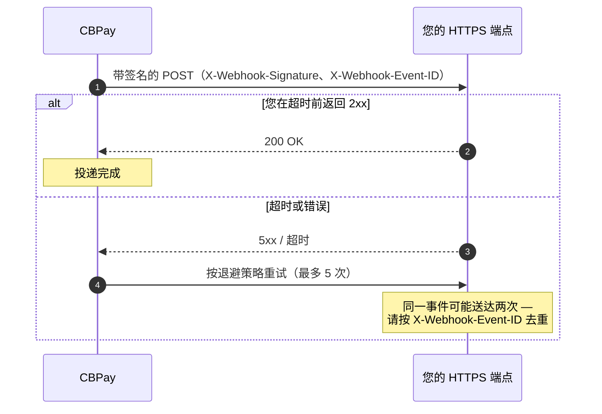

Webhook 会将您账户的事件推送到您自己的 HTTPS 回调地址，并附带加密签名。



## 创建订阅

```bash
curl -X POST https://api.qbank.cl/platform/v1/webhooks/subscriptions \
  -H "Authorization: Bearer <token>" \
  -H "Content-Type: application/json" \
  -d '{
    "event_type": "payout_status_changed",
    "callback_url": "https://api.myapp.com/webhooks/cbpay",
    "secret": "a-secret-of-at-least-16-chars"
  }'
```

- `event_type`：下表中的事件之一，或使用 `*` 订阅全部事件。
- `callback_url`：**必须为 HTTPS**；localhost 和私有 IP 会被拒绝——本地开发请使用
  [HTTPS 隧道](/zh/environment-testing#testing-webhooks-in-local-development)。
- `secret`：至少 16 个字符；用于对每次投递签名。加密存储，无法再次获取。

订阅接收的是**您账户**的事件。您可以随时列出当前有效的订阅：

```bash
curl https://api.qbank.cl/platform/v1/webhooks/subscriptions \
  -H "Authorization: Bearer <token>"
```

```json
{
  "page": 1,
  "page_size": 50,
  "subscriptions": [
    {
      "id": "5f3a…",
      "event_type": "payout_status_changed",
      "callback_url": "https://api.myapp.com/webhooks/cbpay",
      "status": "active",
      "created_at": "2026-07-01T12:00:00Z"
    }
  ]
}
```

## 事件

| 事件 | 触发时机 |
|---|---|
| `payin_credited` | 收到一笔法币代收并已入账 |
| `payout_status_changed` | 一笔付款（payout）状态发生变化 |
| `transfer_received` | 账户收到一笔内部转账 |
| `crypto_deposit_credited` | 一笔链上充值已确认并入账 |
| `crypto_deposit_held` | 一笔入账充值因发送方风险被暂扣（[筛查](/zh/guides/screenings)） |
| `crypto_deposit_alert` | 一笔充值已入账，但发送方显示高风险（仅提示） |
| `crypto_withdrawal_status_changed` | 一笔链上提现状态发生变化 |
| `banking_customer_status_changed` | 您的银行账户资料验证状态发生变化 |
| `banking_operation_status_changed` | 一笔银行付款状态发生变化 |
| `card_transaction` | 一笔卡片消费被授权、撤销或调整 |
| `card_status_changed` | 卡片状态发生变化（包括自动冻结） |
| `kyc_verification_status_changed` / `kyb_verification_status_changed` | 一项身份验证状态发生变化（包括您自身的入驻验证，带 `self_onboarding: true`） |
| `kyc_link_completed` / `kyb_link_completed` | 一个托管验证链接已完成 |
| `kyc_document_validated` / `kyb_document_validated` | 通过 API 上传的文档已完成 OCR |
| `kyc_liveness_completed` | 通过活体检测链接完成了一次活体检测 |
| `aml_screening_updated` | AML 筛查更新（结果、案件、风险、已复核交易） |
| `wallet_deposit_received` | 一笔链上充值到达[独立钱包](/zh/guides/segregated-wallets)（不触及账本） |
| `wallet_send_status_changed` | 独立钱包发起的一笔转出状态发生变化 |
| `wallet_key_exported` | 独立钱包的私钥被导出（安全警报） |
| `wallet_external_movement` | 独立钱包发生了未经平台的链上资金变动（`client` 托管模式下属正常情况） |
| `wallet_key_compromise_suspected` | **严重警报**：`cbpay` 托管钱包出现外部转出——私钥可能已泄露 |

### 各事件的载荷

<CodeGroup>

```json payin_credited
{
  "payin_id": "9c2a…",
  "account_id": "ae8c…",
  "country": "BO",
  "currency": "BOB",
  "local_amount": "700.00",
  "fx_rate": "6.91",
  "usdt_credited": "100.302460",
  "fee": "1.000000"
}
```

```json payout_status_changed
{
  "payout_id": "0d4f…",
  "account_id": "ae8c…",
  "country": "MX",
  "currency": "MXN",
  "local_amount": "1500.00",
  "usdt_amount": "85.714286",
  "total_debit": "86.014286",
  "status": "completed",
  "status_code": ""
}
```

```json transfer_received
{
  "transfer_id": "77b1…",
  "from_account_id": "389d…",
  "to_account_id": "ae8c…",
  "asset": "USDT",
  "amount": "25.000000",
  "description": "Expense split",
  "created_at": "2026-07-06T20:10:00Z"
}
```

```json crypto_deposit_credited
{
  "account_id": "ae8c…",
  "chain": "tron",
  "asset": "USDT",
  "tx_id": "b1946ac9…",
  "amount": "499.000000",
  "fee": "1.000000"
}
```

```json crypto_deposit_held
{
  "account_id": "ae8c…",
  "hold_id": "c1d2e3f4…",
  "chain": "tron",
  "asset": "usdt",
  "tx_id": "8a5b3c…",
  "risk": "Severe",
  "status": "held"
}
```

```json crypto_deposit_alert
{
  "account_id": "ae8c…",
  "chain": "tron",
  "asset": "usdt",
  "tx_id": "9c6d4e…",
  "risk": "High",
  "status": "credited"
}
```

```json crypto_withdrawal_status_changed
{
  "withdrawal_id": "5e8c…",
  "account_id": "ae8c…",
  "chain": "tron",
  "asset": "USDT",
  "tx_id": "7d3f01aa…",
  "status": "completed",
  "amount": "100.000000"
}
```

```json banking_customer_status_changed
{
  "account_id": "ae8c…",
  "customer_id": "9f2b…",
  "kyc_status": "approved"
}
```

```json banking_operation_status_changed
{
  "account_id": "ae8c…",
  "customer_id": "9f2b…",
  "operation_id": "7e8a…",
  "type": "withdraw",
  "status": "completed"
}
```

```json card_transaction
{
  "account_id": "ae8c…",
  "card_id": "3c2b…",
  "transaction_id": "5e4d…",
  "status": "authorized",
  "amount_usdt": "16.170000",
  "merchant": "AMZN Mktp"
}
```

```json card_status_changed
{
  "account_id": "ae8c…",
  "card_id": "3c2b…",
  "status": "frozen",
  "reason": "monthly_fee_unpaid"
}
```

```json kyc_verification_status_changed
{
  "account_id": "ae8c…",
  "kind": "kyc",
  "event": "approved",
  "submission_id": "c3d4…",
  "external_customer_id": "cust_789",
  "status": "approved",
  "risk_band": "low",
  "decision": "approved"
}
```

```json kyb_link_completed
{
  "account_id": "ae8c…",
  "kind": "kyb",
  "event": "link_completed",
  "link_id": "b2c3…",
  "submission_id": "d4e5…",
  "external_customer_id": "cust_456",
  "status": "completed"
}
```

```json kyc_document_validated
{
  "account_id": "ae8c…",
  "kind": "kyc",
  "submission_id": "c3d4…",
  "external_customer_id": "cust_789",
  "category": "identity",
  "outcome": "MATCH",
  "score": 0.97,
  "summary": "Document matches the submitted identity"
}
```

```json kyc_liveness_completed
{
  "account_id": "ae8c…",
  "kind": "kyc",
  "submission_id": "c3d4…",
  "external_customer_id": "cust_789",
  "outcome": "PASS",
  "passed": true
}
```

```json aml_screening_updated
{
  "account_id": "ae8c…",
  "screening_event": "compliance_risk_changed",
  "customer_id": "cus_8f2e…",
  "data": { "risk_level": "high" }
}
```

```json wallet_deposit_received
{
  "wallet_id": "b7e3…",
  "account_id": "ae8c…",
  "chain": "tron",
  "asset": "USDT",
  "tx_id": "b1946ac9…",
  "amount_raw": "125000000",
  "from_address": "TDonor…"
}
```

```json wallet_send_status_changed
{
  "send_id": "9c8b…",
  "wallet_id": "b7e3…",
  "account_id": "ae8c…",
  "chain": "tron",
  "asset": "USDT",
  "tx_id": "b1946ac9…",
  "status": "completed",
  "amount_raw": "25500000"
}
```

```json wallet_key_exported
{
  "wallet_id": "b7e3…",
  "account_id": "ae8c…",
  "chain": "tron",
  "asset": "USDT",
  "address": "TRmSZRaMAqLEevAdGwo3R43bRBXamWR5bd"
}
```

```json wallet_external_movement
{
  "wallet_id": "b7e3…",
  "account_id": "ae8c…",
  "chain": "tron",
  "asset": "USDT",
  "direction": "out",
  "tx_id": "9a3c1e5f…",
  "amount_raw": "25000000",
  "custody": "client"
}
```

```json wallet_key_compromise_suspected
{
  "wallet_id": "b7e3…",
  "account_id": "ae8c…",
  "chain": "tron",
  "asset": "USDT",
  "direction": "out",
  "tx_id": "9a3c1e5f…",
  "amount_raw": "25000000",
  "custody": "cbpay"
}
```

</CodeGroup>

在 `payout_status_changed` 和 `crypto_withdrawal_status_changed` 中，`status` 可以为 `completed` 或 `failed`（若为 `failed`，在您收到该事件时扣款已完成退还）。

## 投递格式

每次投递都是一个 JSON `POST`，带有以下请求头：

| 请求头 | 内容 |
|---|---|
| `X-Webhook-Event` | 事件类型 |
| `X-Webhook-Event-ID` | 事件的唯一 ID |
| `X-Webhook-Delivery-ID` | 本次投递的 ID（重试时会变化） |
| `X-Webhook-Timestamp` | Unix 时间戳（秒，UTC） |
| `X-Webhook-Signature` | HMAC 签名（见下文） |

## 验证签名

```
X-Webhook-Signature = hex( HMAC-SHA256( secret, timestamp + "." + body ) )
```

<CodeGroup>

```javascript Node.js
const crypto = require("crypto");

function verifyWebhook(req, secret) {
  const ts = req.headers["x-webhook-timestamp"];
  const sig = req.headers["x-webhook-signature"];
  const expected = crypto
    .createHmac("sha256", secret)
    .update(ts + "." + req.rawBody)
    .digest("hex");
  return crypto.timingSafeEqual(Buffer.from(sig), Buffer.from(expected));
}
```

```python Python
import hashlib, hmac

def verify_webhook(headers, raw_body: bytes, secret: str) -> bool:
    ts = headers["X-Webhook-Timestamp"]
    sig = headers["X-Webhook-Signature"]
    expected = hmac.new(
        secret.encode(), f"{ts}.".encode() + raw_body, hashlib.sha256
    ).hexdigest()
    return hmac.compare_digest(sig, expected)
```

</CodeGroup>

<Warning>
HMAC 必须基于**原始请求体**（收到的字节原样）计算，而不是重新序列化后的 JSON。请拒绝过旧的时间戳（超过 5 分钟），以防止重放攻击。
</Warning>

## 重试与幂等性

- 您的端点必须在超时前返回 **2xx**；否则将触发重试。
- 最多 **5 次尝试**，采用递增退避：

| 尝试 | 1 | 2 | 3 | 4 | 5 |
|---|---|---|---|---|---|
| 约等待时间 | 立即 | ~5s | ~20s | ~45s | ~80s |

- 使用 `X-Webhook-Event-ID` 去重：同一事件可能送达多次（至少一次投递语义）。
- 如果 5 次尝试全部失败，该事件不会再次发送——请通过资源的 `GET` 接口恢复状态（这也是任何流程都不应只依赖 webhook 的原因）。

## 最佳实践

- 立即返回 `200`，在后台异步处理。
- 记录 `X-Webhook-Delivery-ID` 以便追溯。
- 关键状态不要只依赖 webhook：您随时可以通过 API 查询对象（`GET /v1/payouts/{id}` 等）。
